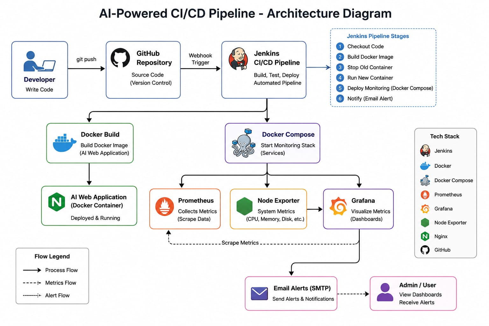
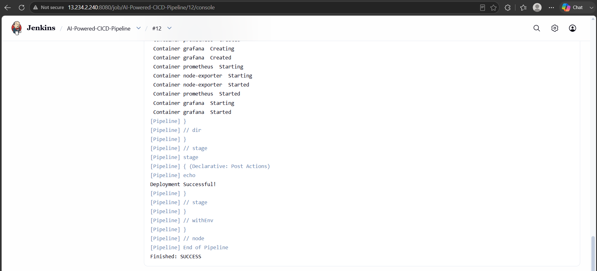
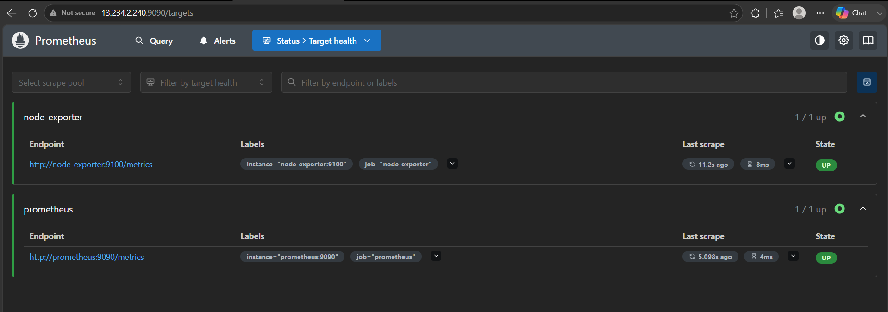
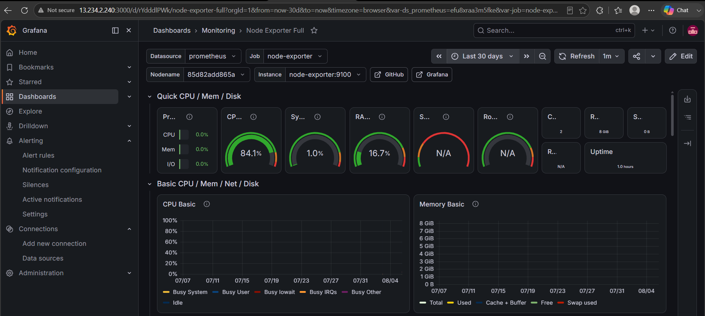
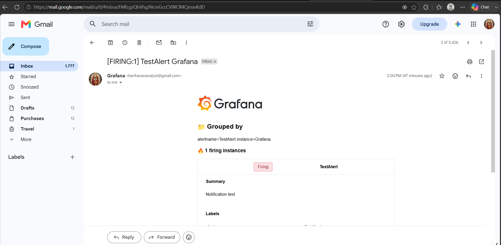

# 🚀 AI Powered CI/CD Pipeline

## 📌 Project Overview

This project demonstrates an end-to-end AI Powered CI/CD Pipeline using Jenkins, Docker, Prometheus, Grafana, and Node Exporter.

The pipeline automatically builds, deploys, monitors the application, and sends email alerts when system metrics exceed the configured threshold.

---

# 🏗 Architecture

See the architecture diagram below.

---

# ✨ Features

- Automated Jenkins CI/CD Pipeline
- Docker Image Build
- Docker Container Deployment
- Docker Compose Monitoring Stack
- Prometheus Metrics Collection
- Node Exporter System Monitoring
- Grafana Dashboards
- Email Alerts using SMTP
- GitHub Integration

---

# 🛠 Tech Stack

- GitHub
- Jenkins
- Docker
- Docker Compose
- Prometheus
- Grafana
- Node Exporter
- Nginx

---

# 📸 Screenshots

## Jenkins Pipeline

## Prometheus Targets

## Grafana Dashboard

## Email Alert

---

# 🚀 Deployment Flow

Developer

↓

GitHub

↓

Jenkins Pipeline

↓

Docker Build

↓

Application Deployment

↓

Docker Compose

↓

Prometheus + Node Exporter

↓

Grafana Dashboard

↓

Email Alerts

---

# 👨‍💻 Author

Hariharan
